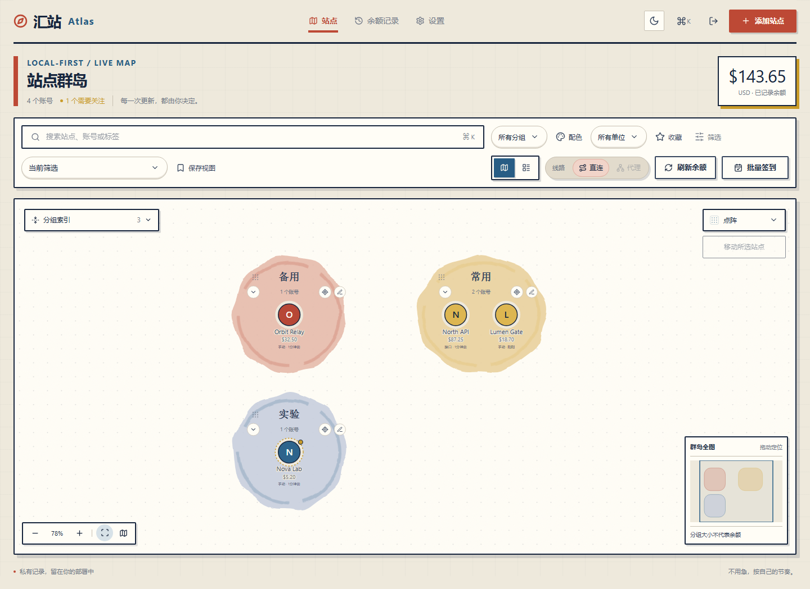

# RelayDock · 汇站 Atlas

独立部署的 AI 中转站管理工具。地图组织账号，记录余额与入口。Bauhaus 工作台使用暖纸面、实体印刷色和几何反馈；仅点击时查询外部站点。没有后台轮询、开放注册或遥测。

## 发布状态与界面

独立源码仓库：[sxxso/relaydock](https://github.com/sxxso/relaydock)。尚未发布稳定版本。**采用 MIT 许可证，版权署名 cjmarklll；Docker 已通过 Ubuntu CI 合成部署验收；七个平台均为夹具验证、实站未验证。** 支持模板不是查询成功保证，仍需在自己的部署中主动测试连接；远端 CI 的实际结果请查看仓库 Actions。



[浅深主题与手机界面](docs/SCREENSHOTS.md) · [更新日志](CHANGELOG.md) · [贡献指南](CONTRIBUTING.md) · [发布检查清单](docs/RELEASE-CHECKLIST.md)

准备独立公开的源码包：[开源导出与首次发布](docs/OPEN-SOURCE.md) · [第三方依赖声明](THIRD-PARTY-NOTICES.md) · [安全问题报告](SECURITY.md)。`npm run release:prepare` 仅导出经过白名单检查的应用源码，不执行 Git 提交或推送。

截图来自实际应用的隔离验收，全部为合成数据，不展示真实账号或凭据，不使用设计效果图。

## 本机启动（Node.js 22.20+）

```powershell
npm ci
npm run setup
npm run doctor -- --development
npm run dev
```

打开 http://127.0.0.1:3000 ，用刚设置的密码登录。首次数据库为空，没有假账号或默认密码。也可 `npm run setup -- --generate` 生成随机密码（只打印一次，请保存）。密码仅以 scrypt 哈希保存。

生产运行：`npm run build` 然后 `npm start`。这两个本机命令默认仅绑定 127.0.0.1。对外部署使用 HTTPS 反向代理，配置 `RELAYDOCK_PUBLIC_URL=https://你的域名`。不要通过 `next start -H 0.0.0.0` 把无 HTTPS 的本机服务直接暴露到公网。

忘记本机密码：停止服务，执行 `npm run setup -- --reset-password`，重新设置密码并重启。此操作会读取 `.env.local` 中的数据目录，已设置的 shell 环境变量优先，并注销该数据库中的所有会话；数据库更新失败时不会宣告重置成功。不要手改数据库密码字段。

## 启动前自检

`npm run doctor` 检查 production 配置；本机开发使用 `npm run doctor -- --development`。检查 Node、数据目录权限、SQLite、管理员、主密钥与必要查询配置；只输出检查结果和建议，**不访问外站、不输出秘密、不创建或修复数据**。

纯 JSON：`npm run --silent doctor -- --json`。退出码 `0=PASS / 1=WARN / 2=FAIL`。首次未初始化是 WARN；非空 WAL/回滚日志、读取期间变化或大于 64 MiB 的数据库不会冒充已通过。主库丢失但有恢复侧车文件、已有数据库缺失密钥或凭据认证不匹配为 FAIL，不能随意生成替代密钥。权限预检不是实际写入/磁盘空间保证。完整用法见 [本地部署自检](docs/DOCTOR.md)。

## 使用

1. 添加站点按「平台 → 地址与凭据 → 点击测试 → 确认单位 → 保存」逐步配置；同一个网站可以有多个账号。新增/编辑的分组菜单可选已保存分组，也可新建。详见 [向导说明](docs/ACCOUNT-WIZARD.md)。
2. 草稿测试不创建账号、不保存凭据或余额；测试结果只供确认。也可明确接受未验证配置后保存，保存不会查询。手动初始余额留空代表未知，填 0 代表零余额。
3. 在详情中“记录余额”，或配置查询后点击“刷新余额”。每次成功记录新增快照；测试连接不会写快照。
4. 搜索、分组、单位、收藏和归档筛选同时作用于地图和列表。Ctrl/Cmd + K 打开快捷入口。
   分组筛选旁的调色板可设置分组颜色：八个预设、自由取色、六位 HEX，支持预览/取消和恢复默认。地图、列表头像及定位小窗同步，改名与备份恢复保留颜色。低余额使用独立标记；自定义文字自动选择深浅。分组改名入口收纳在「更多筛选」中。
5. 在余额记录页看实际历史；在设置中切换浅深主题、关闭动效、备份或修改密码。
6. 详情下方「查询诊断」展示真实阶段耗时、失败类别与下一步提示；可一键复制白名单报告，不含账号、地址、IP、凭据、正文或余额。测试不修改余额，不会自动探测。详见 [诊断说明](docs/DIAGNOSTICS.md)。
7. 金额旁标注实际快照的「手动记录 / 接口查询」、记录距今时间；详情同时显示完整日期。查询失败保留上次金额与来源，连接测试单独标注「未更新余额」。时间提示仅本地更新，没有后台查询。详见 [余额新鲜度](docs/BALANCE-FRESHNESS.md)。
8. 地图搜索淡化其他账号而不重排位置，分组索引可聚焦/折叠，定位小窗导航大地图，背景网格随缩放抽稀。列表「批量管理」可整理分组、标签和归档；明确选中范围，最多 500 项，事务保存不改余额或凭据。详见 [地图与批量管理](docs/MAP-MANAGEMENT.md)。
9. 七个平台模板独立维护请求、解析、能力和合成夹具；验证日期区分夹具、文档与实站。见 [适配器说明](docs/ADAPTERS.md) 和 [贡献指南](CONTRIBUTING.md)；不加载用户脚本，不改变点击查询约束。
10. 分组标题岛内居中：拖住标题/握柄移动整组，松手保存，Esc 取消；标题获得焦点后方向键微调，Home 恢复自动布局。拖动站点仍可组内排序/跨组移动。位置支持重载与备份，不改变余额或历史。自定义 `/v1/usage` 等预设见 [预设对照说明](docs/USAGE-PRESET.md)。
11. 「刷新余额」旁或「设置 → 查询线路」提供直连/代理切换。选择即时保存，不触发查询；仅后续点击查询使用新线路。代理地址仍由部署端显式配置，缺失时按钮禁用；不接管系统代理、不启动代理软件。配置初次添加/更换需重启，之后按钮切换不用重启。详见 [查询与网络设置](docs/QUERYING.md)。
12. New API 账户详情提供「模型表现」：模型目录、成功率、延迟、输出速度和分组趋势，可选 24／72／168 小时。打开只读缓存，点击更新才访问站点；站点统计与个人日志分别标注，缺失值和采样范围明确。详见 [模型表现](docs/MODEL-INSIGHT.md)。
13. New API 详情提供「签到与月历」，工具栏提供「批量签到」：打开只读缓存、按点击操作，提交结果不明时保留「结果待确认」，可选成功后刷新余额。缓存已签时提示刷新，批量执行时再次核对今日状态。适用标准接口、管理凭据和用户 ID；Cookie／验证码需要目标网页操作。详见 [签到与月历](docs/CHECKIN.md)。
14. New API 详情支持主动获取、缓存或手动填写邀请链接，复制与自定义注册地址；打开面板不会自动查询。详见 [邀请链接](docs/INVITATION.md)。
15. 「更多筛选」支持保存、切换与删除视图；收藏、归档和批量整理后可在短时提示中撤销，版本冲突时保留后续修改。特效颜色、浓度与底纹密度可在设置中调整，详见 [特效与地图外观](docs/APPEARANCE.md)。

余额分别按 USD/CNY 统计；自定义积分、原始配额按站点及换算口径隔离，不能被当作同一种钱相加。摘要对应当前筛选结果，不自动换汇。只有已设置阈值的账号才触发低余额提醒。

## 多平台余额查询

采用平台模板与字段映射，不在服务端执行任意 JavaScript。支持：

| 模板                     | 认证 / 口径                                                                      | 验证范围 |
| ------------------------ | -------------------------------------------------------------------------------- | --- |
| New API · 账户余额       | 管理令牌 + 按站点要求填写用户 ID；原始 quota 或已确认换算                        | 夹具验证；实站未验证 |
| New API · 令牌额度       | 模型 API Key；只返回令牌额度，不加入 USD/CNY 账户合计；无限额度不记作零          | 夹具验证；实站未验证 |
| 通用余额                 | Bearer API Key，GET /user/balance，读取 balance；单位由站点文档确认              | 夹具验证；实站未验证 |
| DeepSeek                 | API Key，按所选 CNY/USD 读取 total_balance，不换汇                               | 夹具验证；实站未验证 |
| OpenRouter               | **Management Key**，总额度减已用金额，USD                                        | 夹具验证；实站未验证 |
| SiliconFlow · 旧接口兼容 | 官方旧接口已停用；仅用于仍开放 /v1/user/info 的兼容站点，不保证官方可用          | 夹具验证；实站未验证 |
| 自定义                   | 同源 GET 路径、字段路径、可选扣减字段及除数；认证为 Bearer、x-api-key 或 api-key | 夹具验证；实站未验证 |

自定义计算：`(余额字段 - 可选扣减字段) / 除数`。字段如 `data.balance`、`data.items.0.amount`。只允许声明式读取；路径不接受完整 URL、参数和目录跳转，密钥只放专门的加密凭据字段。

平台预设留空根地址时用官方默认地址；中转／自定义优先使用显式根地址，其次 API 地址／网站地址。预设模板规范化末尾 /v1、/api 或已有查询端点，避免重复拼接；子路径前缀保留。

### New API 配置

- 管理接口根地址如 `https://relay.example`，代理部署在子路径时填完整根路径；查询会追加 `/api/user/self`。
- 使用用户管理 Access Token 或具有读取自身信息权限的个人访问令牌，不是 `sk-...` 模型调用令牌。旧站点可能需要用户 ID。
- 每单位配额系数由站点说明确定；填写系数并勾选确认后才换算。不能假设所有站点都是 500000。
- 未确认换算时记录单位为“配额”，不计入 USD/CNY 汇总。
- “测试连接”显示耗时，不修改余额；“刷新余额”才记录快照。批量并发 3，默认 10 秒，可选 20／30 秒；DNS、连接、读取共用总超时，不重试、不定时。
- 失败保留旧余额及记录时间，显示最近查询错误。状态不是站点可用率。

默认禁止私有、回环、链路本地、云元数据等地址，验证所有 DNS 答案并固定连接地址；不会跟随重定向。确需查询自己的私有中转站时，在 `.env.local` 或容器环境显式设置 `RELAYDOCK_PRIVATE_HOSTS=relay.internal.example`，仅精确匹配主机名。链路本地与云元数据地址不能放行。请勿将不受信任用户设为管理员。

## Docker

复制 `.env.example` 为 `.env`，填写长度至少 12 位的 `RELAYDOCK_ADMIN_PASSWORD`。公网反代部署同时填写 `RELAYDOCK_PUBLIC_URL`：

```sh
docker compose up -d --build
```

默认只将端口映射到本机，本机入口为 `http://127.0.0.1:3000`；用 HTTPS 反向代理对外提供服务。持久化卷 `atlas-data` 同时保存数据库与自动生成的主密钥。镜像以非 root 用户运行。

Ubuntu CI 已实际通过 Docker 镜像、非 root 登录、主动查询、重启持久化、数据库与主密钥迁移、备份及资源清理验收。Compose 人工启动仍待验证。具备 Docker 环境后可运行 `npm run test:docker -- --ready`；实际报告、范围与清理约束见 [Docker 验收](docs/DOCKER-VERIFICATION.md)。

## 备份与迁移

设置页 JSON 导出包括账号档案、历史和偏好，**不包含查询令牌、管理员哈希、会话或主密钥**。导入先预览，再确认；按 ID 合并，不删除其他账号，已有凭据保留，新账号重新填写。导入以数据库事务执行；同一快照 ID 若与现有账号归属冲突，预览和实际导入均会拒绝，现有数据保持不变。

完整迁移：停止服务后安全备份整个 `data` 目录（包含 SQLite、可能存在的 WAL/SHM 和 `vault.key`），或使用 SQLite 备份工具。**仅复制 atlas.sqlite 而不复制 vault.key，无法读取查询令牌。**如果设置了 `RELAYDOCK_VAULT_KEY`，请单独安全保留该环境变量，不能随意换密钥。

数据库/主密钥/环境配置不得提交 Git 或共享到公共存储。Windows 上请确保数据目录仅当前用户可读；Linux 文件以私有权限创建。应用数据库本身包含站点元数据，不是全盘加密数据库。

## 验证

备份现导出版本 3（包含查询映射、底图、稳定快照序号及当前余额快照引用），仍支持导入旧版本 1／2；旧版程序不能读取新版备份。旧备份合并如果不能确定同时间记录的顺序，会在预览与提交时拒绝，保留原数据。地图右上角或设置页可选素纸、点阵、方格、十字坐标、等高线，均为静态原创 SVG，不增加动画循环。

查询超时区分 DNS／连接／等待响应／读取响应；浏览器能打开不代表部署服务器可直连。刷新按钮旁及设置页可切换「直连 / 代理」，保存后即时生效，不自动查询。代理地址由部署端 `RELAYDOCK_QUERY_PROXY_URL` 显式配置，初次配置/改地址需重启；不自动使用 Windows 代理、不自动回退。可选 `RELAYDOCK_DNS_MODE=cloudflare`，默认 system。详见 [查询与网络排查](docs/QUERYING.md)。

```sh
npm test
npm run typecheck
npm run build
npm run test:e2e
npm run test:interactions
npm run test:platforms
npm run test:diagnostics
npm run test:wizard
npm run test:freshness
npm run test:management
npm run test:unit-density
npm run test:drag-query
```

新增全量分组入口（先构建并安装 Chromium）：

```sh
npm run ci:browser -- interface
npm run ci:browser -- query
npm run ci:browser -- management
npm run test:query-focus -- --ready
npm run test:model-insight -- --ready
npm run test:checkin -- --ready
```

CI 对独立应用仓库的 push（main/master）、Pull Request 和手动运行生效，开启 `RELAYDOCK_MAP_GESTURES=1`，执行默认跳过的五项地图手势测试。十五套浏览器回归按界面/查询/管理分组，失败即停。查询聚焦、模型表现、签到和邀请验收必须传 `--ready`，否则只显示待执行而不构建。发布前必须核对[最新提交的全部 CI 任务](https://github.com/sxxso/relaydock/actions/workflows/ci.yml)实际成功，不能用本地静态检查替代。

工作流不使用真实部署 secrets、环境文件或外站账号，只有合成截图和验收摘要作为短期 artifact。运行细节与必需检查见 [贡献指南](CONTRIBUTING.md)。

E2E 脚本会创建隔离的测试数据库、启动自己的本机测试服务，并将截图保存到 `output/playwright`，不修改真实账号。首次需安装 Playwright Chromium：`npx playwright install chromium`。

交互回归使用独立端口 3318 和临时数据库，覆盖定向主题揭幕／失败回滚／旧读取竞态、键盘与触屏选择、地图连续手势及卸载清理、减少动效和静置停帧。报告与截图位于 `output/playwright/interactions`。运行浏览器验收前先构建；交互约定见 [docs/INTERACTIONS.md](docs/INTERACTIONS.md)。

平台／底图回归使用独立端口 3319，报告与截图在 output/playwright/platforms，覆盖多平台、真实慢响应、映射、底图持久化和菜单适配。

真实站点密钥未提供时，仅通过响应夹具及本机测试服务器验证。各站点自定义鉴权/响应格式可能不兼容，请使用测试连接核实。首版不自动签到、充值、转发模型请求或发送外部通知。

## 架构

- Next.js/React/TypeScript；Tailwind、Radix 对话框和无样式选择行为、Lucide 本地图标。
- SVG 数据地图、d3-zoom 相机、独立 Canvas 装饰；静置停帧，触屏/减少动效关闭擦显。
- SQLite + Drizzle；AES-256-GCM 加密令牌，scrypt 密码，HttpOnly/SameSite 会话、Origin+CSRF 校验。
- `src/lib`：精确金额、校验、适配器、网络策略、存储和接口；`src/components`：界面与地图。

视觉为原创实现，只借鉴 MiMo Coder 的纸面、水墨与克制反馈，不使用小米商标、原图或源码。

顶栏月亮／太阳按钮可直接切换主题，设置页保留跟随系统。支持的浏览器使用右上至左下的短时纸幕揭开，不支持时直接切换。关闭装饰动效或启用系统减少动效时不创建主题快照；Canvas 会真正停止而非仅隐藏。纸面选择菜单支持键盘、Esc 和触屏。

## 许可证

本项目采用 [MIT License](LICENSE)，版权声明为 `Copyright (c) 2026 cjmarklll`。

源码交付保留此许可证；Docker 运行阶段复制 LICENSE 和 THIRD-PARTY-NOTICES.md，镜像已通过上述合成部署验收。[第三方说明](THIRD-PARTY-NOTICES.md) 保留锁定生产依赖清单与本机包内原文；未安装的平台包、缺失的上游原文及实际镜像的分发许可仍需核对。源码已公开，稳定版本与容器镜像分发尚未发布。


