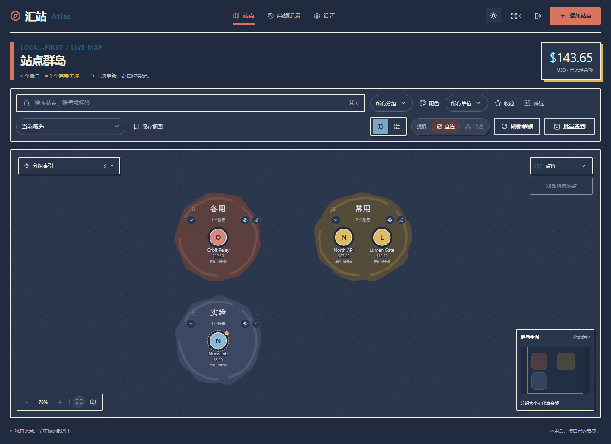
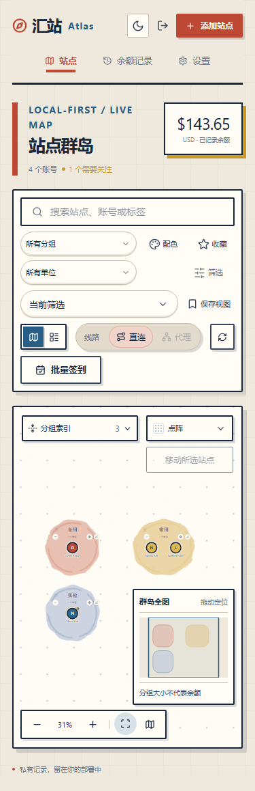
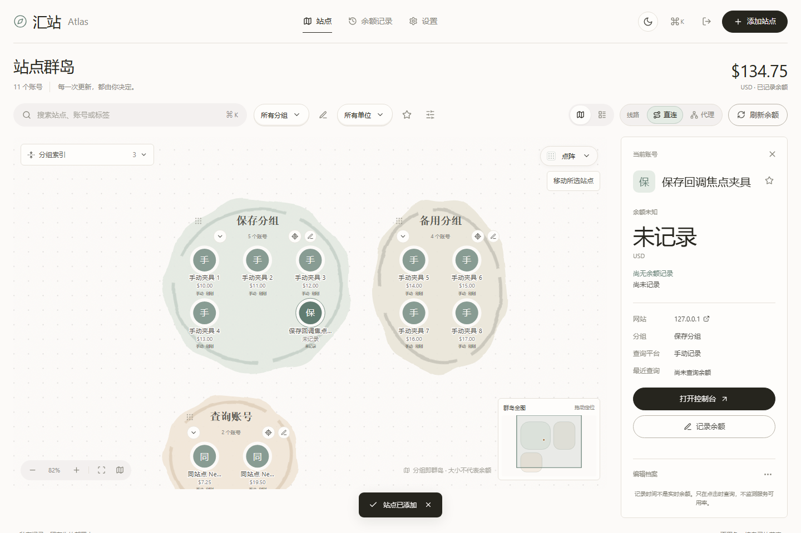
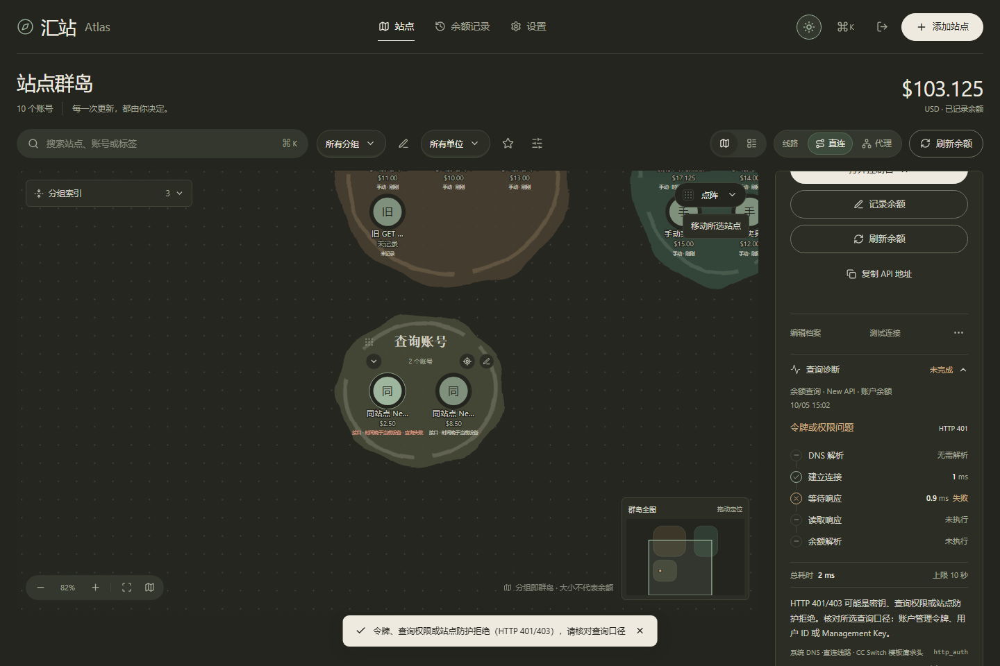
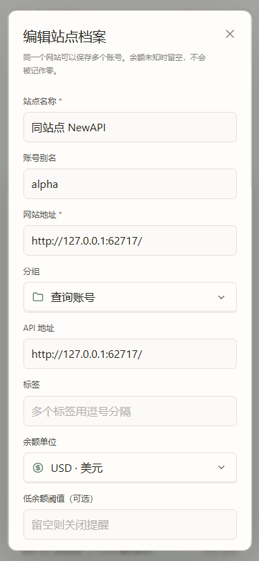

# 界面截图与公开范围

以下图片来自实际运行的汇站 Atlas，不是设计稿或 AI 生成效果图。所有账号名称、金额、用户 ID 和网络响应均为合成夹具；未读取真实配置、密钥或账号。

## 当前界面（2026-10-09）

来源：本轮最终隔离源码生产构建 `98I14RTUs4NWhxXeTm8uP` 的 `test:e2e`，21 项界面检查通过，无浏览器错误。该界面子套件已通过；全套验收状态另见 [当前状态](STATUS.md)。三张 PNG 原样复制，未裁切、重绘或转换编码；均为全页面截图，因此高度超过浏览器视口。

原截图 `map-light-1440.png`，1440×1049；SHA-256 `ee1fcc4e15255f6ce0c12ad05cbee16daffe0fd4f99db31b6523789f0716cb1d`。

原截图 `map-dark-1440.png`，1440×1049；SHA-256 `14faed2c88619e7c1ab3abf6baa04351301ee4b9e408329073a2997f1188f220`。

原截图 `map-light-375.png`，375×1158，主动切换到地图；真实触屏部署默认使用列表。SHA-256 `7a1d5b3a96c678fe1757709e594e9bb197da241c9e5f4596957763807721f80c`。

## 历史界面（2026-10-05）

以下三张 WebP 保留为早期验收来源，不代表当前视觉。

来源：2026-10-05 查询与地图隔离验收，生产构建 ID `389p5kcDHjEOSCtq8KsVo`。原始验收报告记录 `amountsAreSynthetic=true`、`realCredentialsRead=false`、`realProvidersQueried=false`；历史公开范围为三张转为 WebP 的图片，不提交原始报告、服务日志或浏览器状态。

## 浅色地图与选中档案

对应原截图 `1440-light-save-focus.png`，1440×960。

## 深色查询诊断

对应原截图 `1440-dark-map-diagnostic.png`，1440×960。图中的 HTTP 401 是本地夹具刻意返回的错误，用于验证失败保留余额和诊断反馈，不是某家真实平台的可用性报告。

## 手机编辑器

对应原截图 `375-light-editor-profile.png`，375×812。图中的 127.0.0.1 及端口仅是已结束的验收夹具。

图片内容经人工查看；转换只改变编码，不修饰界面或替换数据。未来更新截图继续使用合成数据，并记录构建与验证来源。
